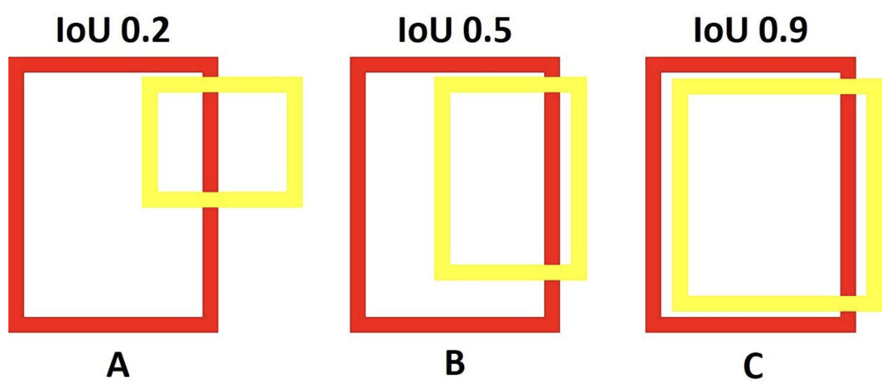
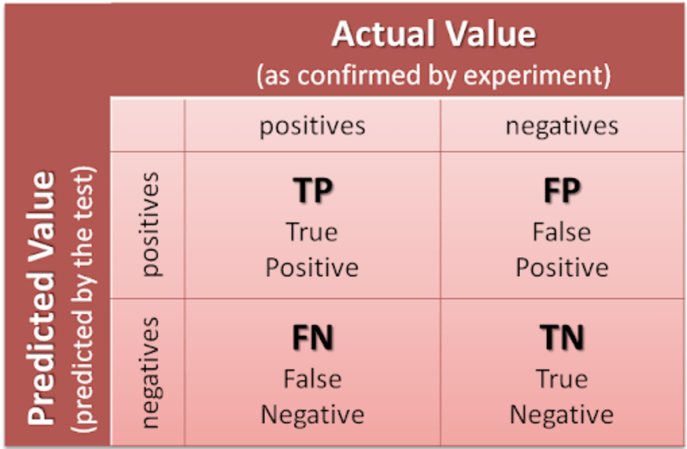

# 객체 탐지 (Object Detection)

## 성능평가 지표

- __mAP@IoU 0.5__
    - IoU가 0.5 이상일 때 정답(True Positive)으로 간주하여 평균 정밀 (AP)를 계산하고, 전체 클래스에 대해 평균을 구함

    - AP (Average Precision)
        - 모델이 하나의 클래스에 대해 얼마나 정확하게 예측했는지를 평가하는 지표
        - PR Curve에서 Recall 축을 기준으로 Precision 값을 적분한 면적이 AP 값
        - 각 클래스마다 AP를 계산할 수 있으며, 이 AP의 평균을 낸 값이 mAP가 된다
        - __AP의 면적이 크다는 것은 모델의 Precision과 Recall이 높은 값을 유지하면서, 둘 간의 균형이 잘 맞는다는 것을 의미__

    - IoU (Intersection over Union)
        - 예측된 바운딩 박스와 실제 바운딩 박스가 얼마나 겹치는지 평가

        - $IoU = \frac{Area_{Intersection}}{Area_{Union}}$
            - $Area_{Intersection}$: 예측된 바운딩 박스와 실제 바운딩 박스의 교집합 면적
            - $Area_{Union}$: 예측된 바운딩 박스와 실제 바운딩 박스의 합집합 면적

            

- Precision & Recall
    - Precision(정밀도)
        - $TP / (TP + FP)$
        - 검출한 포트홀 중 실제 포트홀 비율
        - 쉽게 말해, 모델이 내논 포트홀 중 맞는 것 비율
    - Recall(재현율)
        - $TP / (TP + FN)$
        - 전체 포트홀 중 올바르게 검출한 비율
        - 쉽게 말해, 실제 포트홀 중 모델이 검출한 맞는 포트홀의 비율

        

    > True Positive (TP): 실제값이 True일 때 예측값도 True인 경우\
      False Postiive (FP): 실제값이 False일 때 예측값은 True인 경우\
      True Negative (TN): 실제값이 False일 때 예측값도 False인 경우\
      False Negative (FN): 실제값이 True일 때 예측값은 False인 경우

## 부록
- __Confidence Score__
    - 객체 탐지 모델이 특정 객체를 탐지했을 때, 해당 탐지가 얼마나 신뢰할 수 있는지를 나타내는 점수
    - 일반적으로 0과 1 사이의 값으로 표현되며, 값이 클수록 모델이 해당 탐지를 더 신뢰한다는 의미
    - __confidence threshold__
        - Conf 값이 임계값(Threshold)보다 크면 해당 탐지를 유효한 것으로 간주
        - Conf 값이 낮은 탐지는 노이즈로 간주되어 제거될 수 있음

- 손실 함수 (Loss Function)
    - 모델이 예측한 값과 실제 값의 차이를 측정하는 함수
    - 손실 함수의 값이 작을수록 모델의 예측이 실제 값에 가까워짐
    - 손실 함수는 모델 학습 과정에서 가중치를 업데이트하는 데 사용됨
    - 대표적인 손실 함수
        - MSE (Mean Squared Error)
        - MAE (Mean Absolute Error)
        - Cross-Entropy Loss
        - Focal Loss
